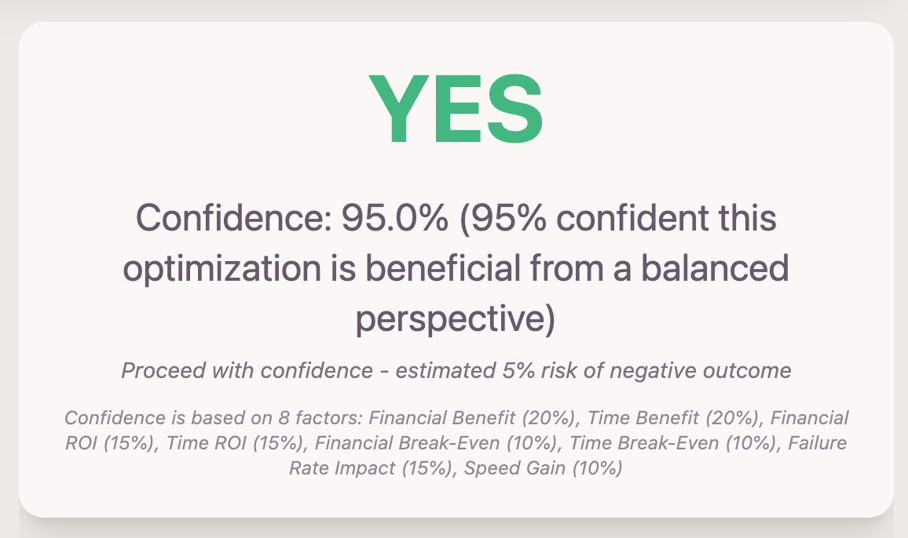
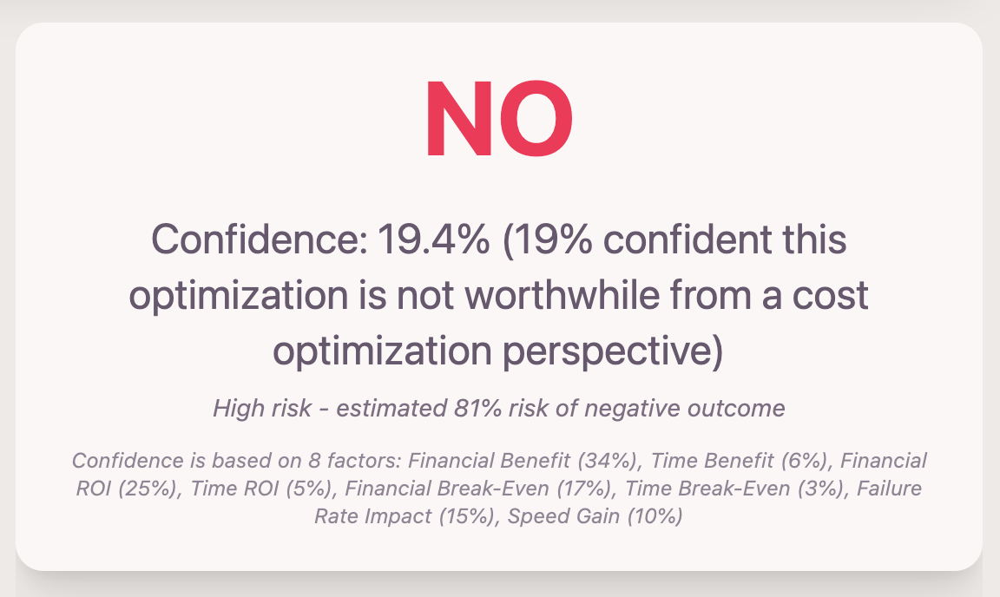
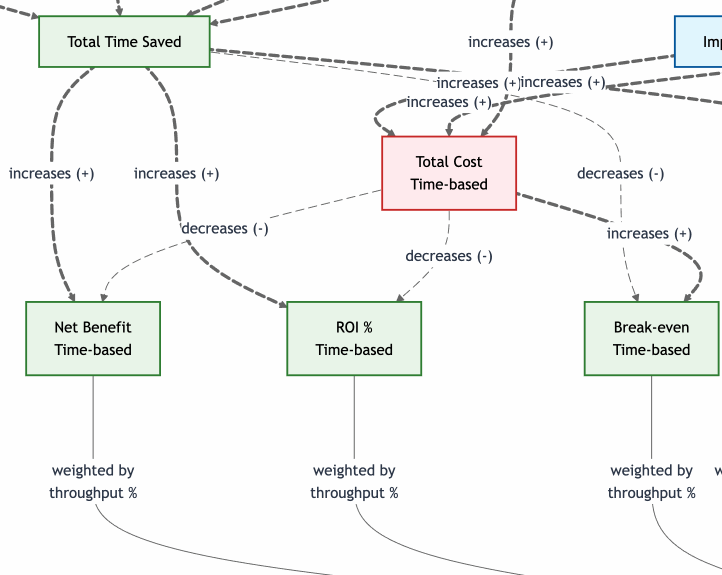

# Is It Worth Speeding It Up?

[](https://opensource.org/licenses/MPL-2.0)

A decision helper for performance optimization: calculates time savings, costs, ROI, and break-even points to determine if an optimization is worthwhile.

🔗 **[Live Demo](https://d-led.github.io/iiwsit/)**

Inspired by [xkcd #1205](https://xkcd.com/1205/).








## Quick Start

```bash
git clone https://github.com/d-led/iiwsit.git
cd iiwsit
npm install
npm run dev
```

Visit `http://localhost:5173`

## Usage

Input your system's parameters:
- Request rate and duration
- Expected speed gain (%)
- Implementation and maintenance time
- Time horizon

Get a **YES/NO/MAYBE** recommendation based on:
- Net time benefit
- ROI calculation
- Break-even analysis
- Risk assessment

### Example Results

**High-traffic API (1000 req/s, 500ms, 30% gain, 80hr work)** → Strong YES ✅
**Low-traffic job (10 req/hr, 2min, 50% gain, 200hr work)** → Strong NO ❌

## Development

```bash
npm run dev          # Start dev server
npm run build        # Build for production
npm test             # Run unit tests
npm run test:e2e     # Run Cypress E2E tests
npm run prettier     # Format code
```

**Tech stack:** TypeScript, Vite, Tailwind CSS, daisyUI, Vitest, Cypress

## Contributing

Contributions welcome! Please:
1. Write tests for new features
2. Run `npm test` and `npm run prettier`
3. Open an issue for major changes first

## License

[Mozilla Public License 2.0](LICENSE) - Use freely, modifications to MPL files must remain MPL.

[](https://app.fossa.com/projects/git%2Bgithub.com%2Fd-led%2Fiiwsit?ref=badge_large)

---

Made with ❤️ and inspired by xkcd. Because not all optimizations are worth optimizing.
